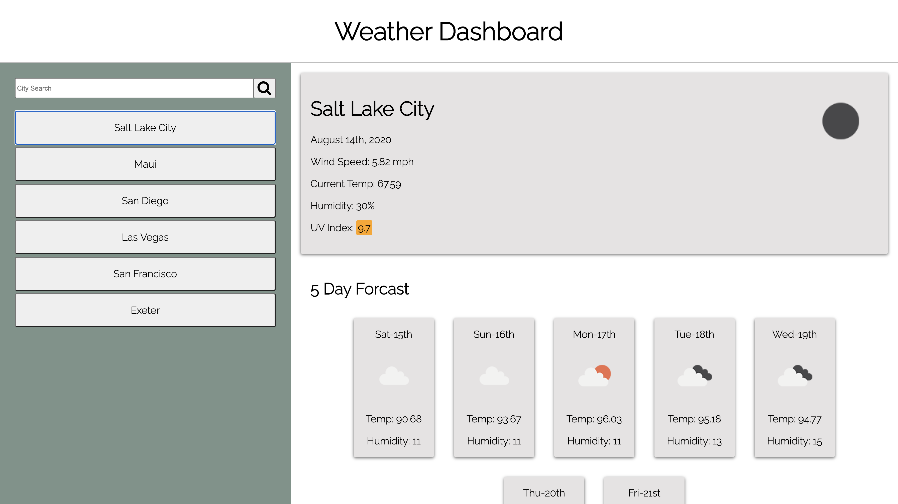

Homework Week 6 - Weather Dashboard

Description:

Enter a city and check out the weather! You will get the city name, the date, an icon representation of weather conditions, the temperature, the humidity, the wind speed, and the UV index. UV index parameters change colors depending on the severity of the value.

Below that there is a 5 day forecaset for that city. Cities are saved as you search for them so you can go back and click on what you have searched for.

When the page re-loads you are given the weather for the last city you searched for. 

Link to repo:

https://github.com/campbelllm/weatherApp

Link to gitHub pages site:

https://campbelllm.github.io/weatherApp/index.html

Preview of site:

